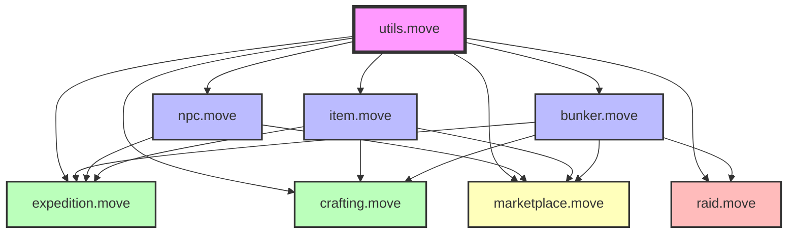
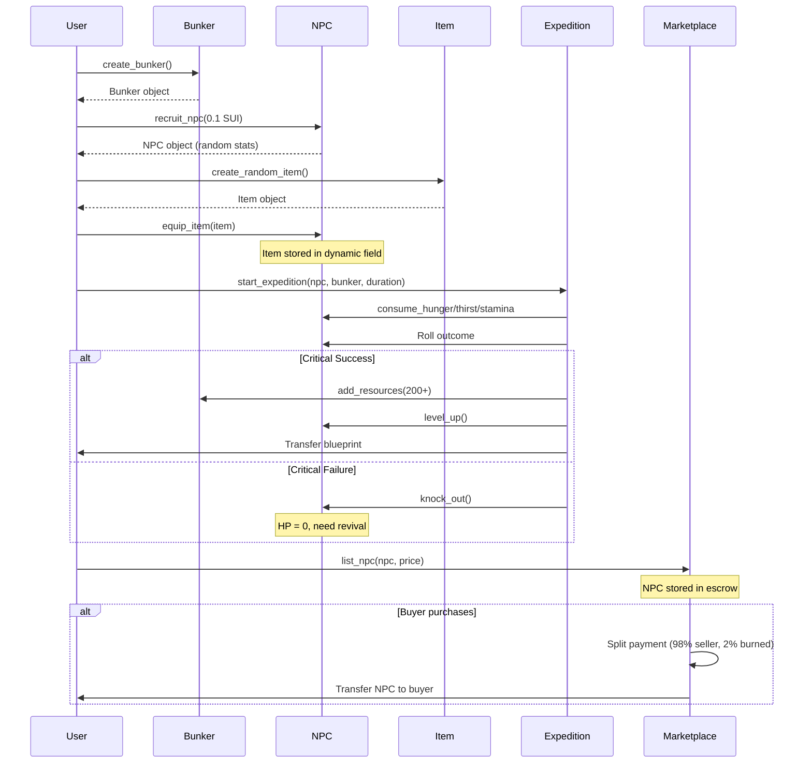

# 🎯 HƯỚNG DẪN ĐỌC VÀ HIỂU CẤU TRÚC CODE - ON-CHAIN BUNKER

> **Mục đích**: Tài liệu này giúp bạn hiểu rõ toàn bộ cấu trúc, cơ chế và logic của project "On-Chain Bunker" để chuẩn bị cho buổi pitching hackathon.

---

## 📋 MỤC LỤC

1. [Tổng quan dự án](#-tổng-quan-dự-án)
2. [Kiến trúc hệ thống](#️-kiến-trúc-hệ-thống)
3. [Chi tiết các Module](#-chi-tiết-các-module)
4. [Cơ chế Game chính](#-cơ-chế-game-chính)
5. [Luồng dữ liệu và tương tác](#-luồng-dữ-liệu-và-tương-tác)
6. [Điểm nhấn công nghệ](#-điểm-nhấn-công-nghệ)
7. [Tips cho buổi Pitching](#-tips-cho-buổi-pitching)

---

## 🎮 TỔNG QUAN DỰ ÁN

**On-Chain Bunker** là một game chiến lược sinh tồn hoàn toàn on-chain trên Sui blockchain. Người chơi quản lý bunker, tuyển NPC, thám hiểm, crafting items, và tương tác với người chơi khác thông qua marketplace và PvP raid system.

### 🎯 Mục tiêu game

- Quản lý bunker và tài nguyên (Food, Water, Scrap, Power)
- Tuyển và phát triển NPCs với stats và skills
- Thám hiểm để kiếm tài nguyên và items
- Craft items từ blueprints
- Giao dịch NPCs/Items trên marketplace
- Tấn công bunker của người khác để cướp tài nguyên

### 🏗️ Tech Stack

- **Blockchain**: Sui Move
- **Paradigm**: 100% on-chain game logic
- **Randomness**: Pseudo-random generation sử dụng TX digest + timestamp + sender
- **NFTs**: NPCs và Items là owned objects
- **Economy**: Deflationary tokenomics (burn 2% platform fee)

---

## 🏛️ KIẾN TRÚC HỆ THỐNG

Project được chia thành **8 modules** chính:



### Phân loại module theo chức năng

| Module             | Vai trò                    | Loại            |
| ------------------ | -------------------------- | --------------- |
| `utils.move`       | Constants, Random, Events  | **Foundation**  |
| `bunker.move`      | Quản lý Bunker & Resources | **Core**        |
| `npc.move`         | Quản lý NPCs               | **Core**        |
| `item.move`        | Quản lý Items & Durability | **Core**        |
| `expedition.move`  | Thám hiểm & Combat         | **Gameplay**    |
| `crafting.move`    | Blueprint & Crafting       | **Progression** |
| `marketplace.move` | Trading Economy            | **Economy**     |
| `raid.move`        | PvP Raids                  | **PvP**         |

---

## 📦 CHI TIẾT CÁC MODULE

### 1. 🔧 `utils.move` - Foundation Module

**Vai trò**: Module nền tảng cung cấp constants, pseudo-random generation, và event definitions

#### Chức năng chính

**A. Hệ thống Rarity (6 tiers)**

```move
RARITY_COMMON      // 0 - 70.0%
RARITY_UNCOMMON    // 1 - 20.0%
RARITY_RARE        // 2 - 7.0%
RARITY_EPIC        // 3 - 2.0%
RARITY_LEGENDARY   // 4 - 0.9%
RARITY_MYTHIC      // 5 - 0.1%
```

**B. Professions (5 nghề)**

- `SCAVENGER` (0): +10% expedition success
- `ENGINEER` (1): Bonus bunker efficiency
- `MEDIC` (2): -5 damage trong expedition
- `GUARD` (3): +5% critical success
- `TRADER` (4): Trading bonus

**C. Pseudo-Random Generation**

```move
function generate_random_u64(clock, ctx): u64
```

- Sử dụng: TX digest + timestamp + sender address
- Hash bằng SHA3-256
- **Quan trọng**: Đây là pseudo-random, phù hợp cho game nhưng không an toàn cho financial apps

**D. Event System**

- 20+ event types tracking mọi hành động
- Phục vụ frontend indexing và game history
- Ví dụ: `RecruitEvent`, `ExpeditionResultEvent`, `KnockoutEvent`

---

### 2. 🏰 `bunker.move` - Bunker Management

**Vai trò**: Quản lý căn cứ chính của người chơi với hệ thống resources và rooms

#### Struct chính

```move
public struct Bunker has key, store {
    id: UID,
    owner: address,
    name: String,
    level: u64,
    capacity: u64,
    current_npcs: u64,

    // Phase 1: Split resources
    food: u64,
    water: u64,
    scrap: u64,

    // Power system
    power_generation: u64,
    power_consumption: u64,

    rooms: vector<Room>,
}

public struct Room has store, copy, drop {
    room_type: u8,
    level: u64,
    capacity: u64,
    efficiency: u64,
    assigned_npcs: u64,
    production_rate: u64,
    last_collected_at: u64,
    accumulated: u64,
}
```

#### Room Types

1. **Living Quarters** (0): Phòng ở NPCs
2. **Generator** (1): Sản xuất điện (+30/h, tiêu -5/h)
3. **Farm** (2): Sản xuất Food (+10/NPC/h)
4. **Water Pump** (3): Sản xuất Water (+15/NPC/h)
5. **Workshop** (4): Dùng cho crafting
6. **Storage** (5): Lưu trữ

#### Chức năng chính

**A. Initialization**

- `create_bunker()`: Tạo bunker mới với 4 phòng ban đầu
- Initial resources: 100 Food, 100 Water, 50 Scrap

**B. Upgrades**

- `upgrade_bunker()`: Level up bunker, +2 capacity/level
- `upgrade_room()`: Level up room cụ thể, +10% efficiency
- `add_room()`: Thêm phòng mới (cost: 150 Scrap)

**C. Resource Management**

- `add_food/water/scrap()`: Thêm tài nguyên
- `consume_food/water/scrap()`: Tiêu thụ tài nguyên
- `collect_production()`: Thu hoạch từ rooms

**D. Power System**

- `recalculate_power()`: Tính toán điện sản xuất vs tiêu thụ
- `is_power_sufficient()`: Check đủ điện
- Các room tiêu thụ điện khác nhau

---

### 3. 👤 `npc.move` - NPC Management

**Vai trò**: Quản lý NPCs - trung tâm của game với stats, equipment, skills

#### Struct chính

```move
public struct NPC has key, store {
    id: UID,
    rarity: u8,           // 0-5: Common → Mythic
    profession: u8,       // 0-4: Scavenger, Engineer, Medic, Guard, Trader
    level: u64,
    max_hp: u64,
    current_hp: u64,
    max_stamina: u64,
    current_stamina: u64,
    hunger: u64,          // 0-100
    thirst: u64,          // 0-100
    strength: u64,        // For workshop efficiency
    skills: vector<u8>,

    // Skill system (Phase 3)
    skill_points: u64,
    respec_count: u64,

    owner: address,
    name: String,
    status: u8,           // IDLE/ON_MISSION/KNOCKED/WORKING
    knocked_at: u64,
    inventory_count: u64,

    // Working system
    assigned_room: Option<u64>,
    work_started_at: u64,
}
```

#### Status Types

```move
STATUS_IDLE = 0       // Rảnh rỗi
STATUS_ON_MISSION = 1 // Đang expedition
STATUS_KNOCKED = 2    // Bất tỉnh (HP = 0)
STATUS_WORKING = 3    // Đang làm việc tại room
```

#### Chức năng chính

**A. Recruitment**

```move
recruit_npc(payment: Coin<SUI>, clock, ctx)
```

- Chi phí: 0.1 SUI (burned)
- Roll random: rarity, profession, stats
- Stats theo rarity:
  - Common: HP 80-100, Stamina 80-100
  - Mythic: HP 230-280, Stamina 230-280

**B. Equipment System (Multi-slot)**

- 4 slots: 1 weapon + 1 armor + 2 tools
- `equip_item()`: Trang bị item vào slot phù hợp
- `unequip_item_by_slot()`: Tháo item
- `get_equipped_bonus()`: Tính tổng bonus từ tất cả items

**C. Inventory System**

- Max 20 items trong inventory
- Dynamic fields với keys: `inv_0`, `inv_1`, ... `inv_19`
- `add_item_to_inventory()`: Thêm item
- `remove_item_from_inventory()`: Lấy ra item

**D. Level Up**

```move
level_up(npc, clock)
```

- +5 max HP, +10 max stamina
- +1 skill point (Phase 3)
- Heal một phần khi level up

**E. Knockout & Revival**

- `knock_out()`: NPC bị hạ (HP = 0, status = KNOCKED)
- `revive_npc()`: Dùng Revival Potion để hồi sinh
- `recover_npc()`: Tự hồi sau 1 giờ (60% HP)
- `instant_recover_npc()`: Instant recovery bằng resources (80% HP)

**F. Survival System (Phase 1)**

- Hunger/Thirst decay passive: 5/10 per hour
- Khi làm việc: thêm 3/5 decay
- Nếu < 10 hunger/thirst: -5 HP/hour (starvation)
- `feed_npc_from_bunker()`: Cho ăn từ bunker
- `give_water_from_bunker()`: Cho nước từ bunker

**G. Skill System (Phase 3)**
10 skills:

- `NIGHT_VISION`: +10% success (long expeditions)
- `FAST_WORKER`: +15% production speed
- `IRON_STOMACH`: -20% hunger decay
- `DESERT_RAT`: -20% thirst decay
- `LUCKY_SCAVENGER`: +10% item drop
- `COMBAT_VETERAN`: +5% expedition success
- `EFFICIENT_WORKER`: -10% power consumption
- `RESOURCEFUL`: +20% scrap from expeditions
- `TOUGH`: +20 max HP (permanent)
- `ENDURANCE`: +20 max stamina (permanent)

Functions:

- `learn_skill()`: Học skill (cost: 1 skill point)
- `respec_skills()`: Reset skills (first free, sau đó 0.1 SUI)

---

### 4. ⚔️ `item.move` - Item Management

**Vai trò**: Quản lý items với rarity, bonuses, và durability system

#### Struct chính

```move
public struct Item has key, store {
    id: UID,
    name: String,
    rarity: u8,           // 1-4 (Common → Legendary)
    item_type: u8,        // 1-6, 99

    // Phase 3: Durability
    durability: u64,
    max_durability: u64,

    // Bonuses
    hp_bonus: u64,
    attack_bonus: u64,
    defense_bonus: u64,
    luck_bonus: u64,
}
```

#### Item Types

```move
TYPE_WEAPON = 1          // Tăng attack
TYPE_ARMOR = 2           // Tăng defense, HP
TYPE_TOOL = 3            // Tăng luck
TYPE_MEDICINE = 4        // Consumable (heal)
TYPE_REVIVAL_POTION = 5  // Consumable (revive)
TYPE_FOOD = 6            // Consumable (hunger)
TYPE_COLLECTIBLE = 99    // Sưu tầm
```

#### Stat Distribution theo Type

- **Weapon**: Attack x2, Luck x0.5
- **Armor**: HP x1, Defense x2
- **Tool**: Attack x0.5, Defense x0.5, Luck x2
- **Medicine**: HP x3 (when consumed)

#### Durability System (Phase 3)

**Max Durability theo Rarity**

- Common: 100
- Rare: 200
- Epic: 300
- Legendary: 500

**Durability Decay theo Expedition Outcome**

- Critical Success: -1
- Success: -2
- Partial Success: -3
- Failure: -5
- Critical Failure: -10

**Repair**

```move
repair_item(item, bunker, payment, clock, ctx)
```

- Cost: 2 Scrap per durability point + 0.01 SUI (burned)
- Restore to full durability
- Broken items (0 durability) give 0 bonuses

**Functions**

- `create_random_item()`: Tạo item random
- `create_item_with_params()`: Tạo item với params cụ thể (for crafting)
- `reduce_durability()`: Giảm độ bền
- `is_broken()`: Check broken
- `get_effective_attack/defense/hp/luck()`: Bonuses (0 nếu broken)

---

### 5. 🗺️ `expedition.move` - Exploration & Combat

**Vai trò**: Hệ thống thám hiểm với TRUE RISK & REWARD

#### Outcome Thresholds

```move
CRITICAL_SUCCESS: 95-100 (5%)
SUCCESS: 45-94 (50%)
PARTIAL_SUCCESS: 25-44 (20%)
FAILURE: 5-24 (20%)
CRITICAL_FAILURE: 0-4 (5%) // NPC KNOCKED OUT
```

#### Chức năng chính

**A. Start Expedition**

```move
start_expedition(npc, bunker, duration, clock, ctx)
```

**Validation**:

- NPC phải IDLE
- HP > 20, Stamina > 30
- Hunger >= 20, Thirst >= 20

**Costs**:

- Hunger: -20
- Thirst: -15
- Stamina: 20 + (duration x 5)

**B. Success Rate Calculation**

```move
calculate_success_rate(npc, duration): (success_rate, item_chance)
```

Factors:

1. **Base**: 50%
2. **Combat Power**: NPC HP + Stamina + skills + rarity + level
   - Mỗi 100 power = +5%
3. **Duration Penalty**: Mỗi giờ thêm = -2%
4. **Profession Bonus**:
   - Scavenger: +10%
   - Guard: +5%
   - Medic: +5%
5. **Weapon Bonus**: Attack / 5 = +% success
6. **Cap**: Max 90%

**Item Chance**:

- Base: 30 + (level x 2)
- Luck Bonus: luck / 3
- Cap: 70%

**C. Outcome Handlers**

**Critical Success**:

- Resources: 200 + (duration x 50)
- Damage: 0
- Level up: YES
- Items: High chance
- Blueprint: 15% chance

**Success**:

- Resources: 100 + (duration x 30)
- Damage: 10 (mitigated by armor)
- Level up: YES
- Items: Normal chance
- Blueprint: 8% chance

**Partial Success**:

- Resources: 50 + (duration x 10)
- Damage: 25 (mitigated)
- Level up: NO
- Items: NO
- Blueprint: 3% chance

**Failure**:

- Resources: 0
- Damage: 50 (mitigated)

**Critical Failure**:

- Resources: 0
- Damage: NPC KNOCKED OUT (HP = 0)
- Cần Revival Potion hoặc recovery time

**D. Damage Calculation**

```move
calculate_damage(npc, base_damage): u64
```

- Medic profession: -5 damage
- Armor/Defense reduction: (HP bonus + Defense bonus) / 5

**E. Durability Integration (Phase 3)**

- Sau mỗi expedition: `reduce_equipped_durability(npc, outcome)`
- Giảm độ bền của TẤT CẢ items equipped

---

### 6. 🛠️ `crafting.move` - Blueprint & Crafting System

**Vai trò**: Phase 3 - Cho phép craft items từ blueprints

#### Struct chính

```move
public struct Blueprint has key, store {
    id: UID,
    item_type: u8,       // What to craft
    rarity: u8,          // Blueprint rarity
    uses_remaining: u64, // Multi-use
    max_uses: u64,
}
```

#### Blueprint Uses theo Rarity

- Common: 3 uses
- Uncommon: 5 uses
- Rare: 8 uses
- Epic: 12 uses
- Legendary: 20 uses
- Mythic: 30 uses

#### Crafting Costs (Scrap)

- Weapon: 50
- Armor: 60
- Tool: 40
- Food: 20
- Medicine: 30

#### Chức năng chính

**A. Create Blueprint**

```move
create_blueprint(item_type, rarity, ctx): Blueprint
```

- Called from expedition khi drop blueprint
- Drop rate tùy thuộc expedition outcome

**B. Craft Item**

```move
craft_item(blueprint, bunker, clock, ctx)
```

- Consume scrap từ bunker
- Reduce blueprint uses (-1)
- Create item với rarity của blueprint
- Transfer item cho crafter

**C. Destroy Blueprint**

```move
destroy_blueprint(blueprint)
```

- Chỉ khi uses_remaining = 0

---

### 7. 🏪 `marketplace.move` - Trading Economy

**Vai trò**: Phase 2 - Marketplace với 2% platform fee

#### Struct chính

```move
public struct Marketplace has key {
    id: UID,
    npc_listings: Table<ID, NPCListing>,
    item_listings: Table<ID, ItemListing>,
    bundle_listings: Table<ID, BundleListing>,
    platform_fee_percent: u64,  // 200 = 2%
    total_volume_sui: u64,
}
```

#### Chức năng chính

**A. NPC Trading**

```move
list_npc(marketplace, npc, price, clock, ctx)
buy_npc(marketplace, npc_id, payment, clock, ctx)
delist_npc(marketplace, npc_id, ctx)
```

**Validation khi list**:

- NPC phải IDLE
- Không có equipped items
- Không knocked

**Fee Distribution**:

- Platform fee: 2% (burned)
- Seller: 98%

**B. Item Trading**

```move
list_item(marketplace, item, price, clock, ctx)
buy_item(marketplace, item_id, payment, clock, ctx)
delist_item(marketplace, item_id, ctx)
```

**C. Resource Bundle Trading**

```move
create_resource_bundle(marketplace, bunker, resource_type, price, clock, ctx)
buy_resource_bundle(marketplace, listing_id, bunker, payment, clock, ctx)
cancel_resource_bundle(marketplace, listing_id, bunker, ctx)
```

**Bundle Sizes**:

- Food Crate: 100
- Water Crate: 100
- Scrap Crate: 50

**Mechanism**:

1. Seller consume resources từ bunker → tạo listing
2. Buyer mua listing → resources add vào buyer's bunker
3. Seller nhận SUI (minus 2% fee)

---

### 8. ⚔️ `raid.move` - PvP System

**Vai trò**: Phase 4 - Tấn công bunker của người khác

#### Struct chính

```move
public struct RaidHistory has key {
    id: UID,
    last_raid_times: Table<address, u64>,
    daily_raid_counts: Table<address, RaidCount>,
}

public struct RaidCount has store {
    count: u64,
    reset_at: u64,
}
```

#### Costs & Limits

- **Cost**: 50 Scrap + 0.1 SUI (burned)
- **Cooldown**: 24h per defender bunker
- **Daily Limit**: 3 raids/day per attacker

#### Combat Calculation

```move
start_raid(attacker_bunker, attacker_npc_count, defender_bunker, payment, raid_history, clock, ctx)
```

**Power Calculation**:

- Attacker Power: NPC count x 100
- Defender Power: Bunker level x 100
- Home Advantage: Defender +10%
- Randomness: ±10%

**Outcome**:

- **Attacker Wins**: Loot 20% resources (Food, Water, Scrap) from defender
- **Defender Wins**: Defender nhận +10 Scrap

**Events**:

```move
public struct RaidResult {
    attacker: address,
    defender: address,
    attacker_npc_count: u64,
    success: bool,
    attacker_power: u64,
    defender_power: u64,
    food_looted: u64,
    water_looted: u64,
    scrap_looted: u64,
    timestamp: u64,
}
```

---

## 🎯 CƠ CHẾ GAME CHÍNH

### 1. 🎲 Progression Loop

```
Recruit NPC (0.1 SUI)
    ↓
Equip Items
    ↓
Go Expedition
    ↓
Success → Resources + Items + Level Up
    ↓
Craft Better Items (from Blueprints)
    ↓
Stronger Expeditions / PvP Raids
```

### 2. 💰 Economic Loop

```
Resources (Food, Water, Scrap)
    ↓
Use for:
- Bunker Upgrades
- Feed NPCs
- Crafting
- Instant Recovery
    ↓
Earn from:
- Expeditions
- Raids
- Marketplace Trading
```

### 3. ⚔️ Risk & Reward

**High Risk**:

- Expedition có thể fail → NPC knocked out
- Items lose durability
- Raid có thể thua → mất resources
- Marketplace fee 2%

**High Reward**:

- Critical success → 200+ resources + blueprints + level up
- Raid thành công → +20% resources
- Rare NPCs/Items có giá trị cao
- Deflationary economy (burned SUI)

---

## 🔄 LUỒNG DỮ LIỆU VÀ TƯƠNG TÁC

### Player Journey



### Data Flow

```
┌─────────────────────────────────────────────────────┐
│                   BLOCKCHAIN STATE                   │
├─────────────────────────────────────────────────────┤
│                                                       │
│  ┌─────────────┐    ┌─────────────┐                │
│  │   Bunker    │    │     NPC     │                │
│  │  (Owned)    │    │  (Owned)    │                │
│  │             │    │             │                │
│  │ - Resources │    │ - Stats     │                │
│  │ - Rooms     │    │ - Skills    │                │
│  │ - Level     │    │ - Inventory │                │
│  └─────────────┘    └─────┬───────┘                │
│                            │                         │
│                     Dynamic Fields                   │
│                            │                         │
│              ┌─────────────┼─────────────┐         │
│              │             │              │         │
│         Equipment       Inventory      Consumables │
│         (4 slots)       (20 slots)                  │
│                                                      │
│  ┌──────────────────┐   ┌──────────────────┐       │
│  │   Marketplace    │   │   RaidHistory    │       │
│  │   (Shared)       │   │   (Shared)       │       │
│  │                  │   │                  │       │
│  │ - Listings       │   │ - Cooldowns      │       │
│  │ - Escrow         │   │ - Daily Limits   │       │
│  └──────────────────┘   └──────────────────┘       │
│                                                      │
└──────────────────────────────────────────────────────┘
```

---

## ✨ ĐIỂM NHẤN CÔNG NGHỆ

### 1. 🎲 On-Chain Randomness

**Pseudo-Random Generation**

```move
function generate_random_u64(clock, ctx):
    seed = TX_digest + timestamp + sender
    hash = SHA3_256(seed)
    return first_8_bytes(hash)
```

**Use Cases**:

- NPC recruitment (rarity, profession, stats)
- Expedition outcomes
- Item drops
- Blueprint drops

**Security Consideration**:

- Phù hợp cho gaming
- Không phù hợp cho financial apps
- Validator có thể ảnh hưởng timestamp nhẹ

### 2. 🎒 Dynamic Fields for Equipment

**Multi-Slot System**:

```move
Slot Keys:
- "slot_weapon"
- "slot_armor"
- "slot_tool_1"
- "slot_tool_2"

Inventory Keys:
- "inv_0" ... "inv_19"
```

**Benefits**:

- Items được store trực tiếp trong NPC UID
- Không cần separate inventory contract
- Gas-efficient
- Type-safe

### 3. 🔥 Deflationary Tokenomics

**Burn Mechanisms**:

1. Recruitment: 0.1 SUI → burned
2. Marketplace fee: 2% → burned
3. Raid cost: 0.1 SUI → burned
4. Repair cost: 0.01 SUI → burned
5. Respec cost: 0.1 SUI → burned (after first)

**Total Burn Rate**: Cao → SUI scarcity tăng → price appreciation

### 4. 📊 Event-Driven Architecture

**20+ Event Types**:

- Frontend có thể index realtime
- Game history tracking
- Analytics và metrics
- Leaderboards

**Example**:

```move
public struct ExpeditionResultEvent {
    npc_id: address,
    owner: address,
    success: bool,
    food_gained: u64,
    water_gained: u64,
    scrap_gained: u64,
    items_gained: u64,
    damage_taken: u64,
    timestamp: u64,
}
```

### 5. 🛡️ Security Features

**Ownership Checks**:

```move
assert!(bunker::get_owner(bunker) == sender, E_NOT_OWNER);
assert!(npc::get_owner(npc) == sender, E_NOT_OWNER);
```

**State Validation**:

```move
assert!(npc::get_status(npc) == STATUS_IDLE, E_NPC_NOT_IDLE);
assert!(bunker::is_power_sufficient(bunker), E_INSUFFICIENT_POWER);
```

**Resource Verification**:

```move
assert!(bunker::get_scrap(bunker) >= cost, E_INSUFFICIENT_SCRAP);
assert!(coin::value(&payment) >= amount, E_INSUFFICIENT_PAYMENT);
```

---

## 🎤 TIPS CHO BUỔI PITCHING

### 1. 📊 Giới thiệu dự án (2 phút)

**Hook mạnh**:

> "On-Chain Bunker là game chiến lược sinh tồn hoàn toàn on-chain đầu tiên trên Sui, nơi mọi hành động - từ tuyển NPC, thám hiểm, crafting, đến PvP raids - đều được thực thi và verify 100% on-chain."

**Problem Statement**:

- Blockchain games hiện tại phần lớn chỉ on-chain ở NFTs
- Game logic off-chain → không transparent, dễ cheat, không trustless
- Cần game thực sự decentralized

**Solution**:

- 100% on-chain game logic trên Sui Move
- True ownership (NPCs, Items là owned objects)
- Pseudo-random on-chain (không cần oracle)
- Deflationary economy

### 2. 🎮 Demo các tính năng chính (5 phút)

**A. Core Loop** (1 phút)

1. Tạo bunker
2. Recruit NPC (show rarity roll)
3. Equip item
4. Start expedition (show outcome calculation)
5. Level up

**B. Advanced Features** (2 phút)

1. **Crafting**: Show blueprint → craft item
2. **Marketplace**: List NPC → buy with fee distribution
3. **Raid**: Attack bunker → loot resources

**C. Survival Mechanics** (1 phút)

1. **Resource Management**: Food, Water, Scrap, Power
2. **Hunger/Thirst System**: NPC needs maintenance
3. **Knockout & Revival**: NPC bất tỉnh → revival mechanism

**D. Progression** (1 phút)

1. **Skill System**: 10 skills, respec
2. **Durability**: Items degrade, need repair
3. **Bunker Upgrades**: Rooms, capacity

### 3. ✨ Điểm nhấn kỹ thuật (2 phút)

**A. On-Chain Randomness**

```
TX_digest + timestamp + sender → SHA3_256 → Random
```

- Không cần Chainlink VRF
- Phù hợp cho game mechanics
- Demonstrable và verifiable

**B. Dynamic Fields**

```
NPC.id → Dynamic Fields:
  - "slot_weapon" → Item
  - "slot_armor" → Item
  - "inv_0" → Item
  - ...
```

- Gas-efficient
- Type-safe
- Elegant design

**C. Deflationary Economics**

```
Every action burns SUI:
- Recruit: 0.1 SUI
- Marketplace: 2% fee
- Raid: 0.1 SUI
```

- Sustainable economy
- Price appreciation
- Long-term value

**D. Event-Driven**

```
20+ Event types → Frontend indexing → Realtime updates
```

- No need centralized backend
- Transparent game history
- Analytics ready

### 4. 🚀 Roadmap & Vision (1 phút)

**Completed (MVP)**:

- ✅ Phase 1: Foundation (Bunker, NPC, Resources)
- ✅ Phase 2: Economy (Marketplace)
- ✅ Phase 3: Progression (Crafting, Skills, Durability)
- ✅ Phase 4: PvP (Raid System)

**Future Plans**:

- 🔮 Phase 5: Guilds & Alliances
- 🔮 Phase 6: Territory Control
- 🔮 Phase 7: Seasonal Events
- 🔮 Phase 8: Cross-chain bridges

**Ultimate Vision**:

> "Một vũ trụ game hoàn toàn on-chain nơi players truly own their assets, game logic hoàn toàn transparent, và economy tự điều chỉnh thông qua deflationary tokenomics."

### 5. 🎯 Q&A Preparation

**Câu hỏi thường gặp**:

**Q: Random on-chain có fair không?**
A: Pseudo-random sử dụng TX digest (unique mỗi TX) + timestamp + sender address. Validator không thể manipulate TX digest. Timestamp manipulation chỉ ảnh hưởng vài ms → negligible impact. Phù hợp cho game, đủ unpredictable.

**Q: Gas cost cho on-chain game?**
A: Sui có transaction sponsorship → có thể sponsor gas cho players. Ngoài ra, việc burn SUI trong game tạo deflationary pressure → long-term sustainable.

**Q: Tại sao không dùng Chainlink VRF?**
A:

- Cost: VRF đắt hơn nhiều
- Latency: Phải đợi oracle response
- Complexity: Thêm external dependency
- Game fairness: Pseudo-random đủ cho game mechanics

**Q: Scalability với nhiều players?**
A: Sui parallel execution → NPCs là owned objects → transactions không conflict → high throughput. Marketplace và RaidHistory là shared objects nhưng optimize với Table structure.

**Q: Security vulnerabilities?**
A:

- ✅ Ownership checks everywhere
- ✅ State validation
- ✅ No reentrancy (Move không có)
- ✅ Type safety
- ✅ Resource safety (linear types)

**Q: Monetization model?**
A:

- 2% marketplace fee (burned → deflation)
- Recruitment fees (0.1 SUI burned)
- Future: Premium cosmetics, season passes
- NOT pay-to-win

---

## 📚 TÀI LIỆU THAM KHẢO

### Code Structure

```
Contracts/
├── sources/
│   ├── utils.move       # Foundation
│   ├── bunker.move      # Core: Bunker management
│   ├── npc.move         # Core: NPC management
│   ├── item.move        # Core: Item system
│   ├── expedition.move  # Gameplay: Exploration
│   ├── crafting.move    # Progression: Crafting
│   ├── marketplace.move # Economy: Trading
│   └── raid.move        # PvP: Raids
└── tests/
    └── contracts_tests.move
```

### Key Metrics

| Metric              | Value  |
| ------------------- | ------ |
| Total Lines of Code | ~4,500 |
| Number of Modules   | 8      |
| Number of Structs   | 15+    |
| Number of Functions | 150+   |
| Number of Events    | 20+    |

### Tech Stack Summary

```
┌─────────────────────────────────────┐
│         Sui Blockchain              │
│         Move Language               │
├─────────────────────────────────────┤
│  Smart Contracts:                   │
│  - 8 modules                        │
│  - Owned objects (NPC, Bunker,      │
│    Item)                            │
│  - Shared objects (Marketplace,     │
│    RaidHistory)                     │
│  - Dynamic fields (Equipment,       │
│    Inventory)                       │
├─────────────────────────────────────┤
│  Mechanisms:                        │
│  - Pseudo-random generation         │
│  - Event-driven architecture        │
│  - Deflationary tokenomics          │
│  - Multi-slot equipment             │
│  - Durability system                │
│  - Skill tree                       │
└─────────────────────────────────────┘
```

---

## 🎬 KẾT LUẬN

**On-Chain Bunker** là một demonstration mạnh mẽ về khả năng của Sui Move trong việc xây dựng **fully on-chain games**.

**Điểm mạnh**:
✅ 100% on-chain logic  
✅ True ownership (owned objects)  
✅ Pseudo-random on-chain  
✅ Deflationary economy  
✅ Rich gameplay (Exploration, Crafting, Trading, PvP)  
✅ Security-first design  
✅ Event-driven architecture  
✅ Gas-efficient (parallel execution)

**Innovation highlights**:
🚀 Dynamic fields cho equipment system  
🚀 Multi-outcome expedition với knockout mechanic  
🚀 Blueprint-based crafting  
🚀 Durability system cho items  
🚀 PvP raid với cooldowns  
🚀 Survival mechanics (hunger/thirst)  
🚀 Skill trees với respec

**Ready for Hackathon**:

- ✅ Fully functional MVP
- ✅ All 4 phases implemented
- ✅ Comprehensive documentation
- ✅ Clean, well-commented code
- ✅ Event emission for frontend
- ✅ Security best practices

---

**Chúc bạn pitching thành công! 🎉**

_Nhớ nhấn mạnh vào sự khác biệt của fully on-chain game và potential của Sui Move trong việc xây dựng complex game logic on-chain._
