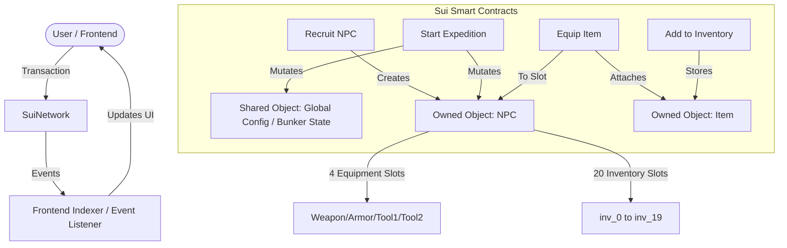

# 🛡️ ON-CHAIN BUNKER - Technical Documentation

> **Lưu ý**: Tài liệu này tập trung vào **Kiến trúc Kỹ thuật** và **Cấu trúc Source Code** của hệ thống Smart Contracts trên Sui Blockchain.

## 🎉 Latest Updates

**Version 4.0** - Full Roadmap Complete! 🚀

## 🚢 Testnet Deploy Notes (Quan trọng)

- Xem hướng dẫn chi tiết: [TESTNET_README.md](TESTNET_README.md)
- Dự án hiện chạy **testnet-only**. Mỗi lần `sui move publish` sẽ ra **PACKAGE_ID mới** → cập nhật lại `frontend/src/constants.ts` (hoặc set `VITE_PACKAGE_ID` trong `.env.local`).
- **Breaking change dữ liệu on-chain**: struct `Room` đã thay đổi layout (thêm trường `production_remainder`) nên **Bunker objects cũ sẽ không tương thích** với package mới.
  - Sau khi republish, hãy **tạo bunker mới** bằng flow UI/entry `bunker::create_bunker`.
  - Nếu frontend đang load cả bunker cũ, bạn có thể gặp lỗi parse/hiển thị; nên tạo mới để test gameplay.

### Phase 4: PvP Raid System ⚔️ (NEW!)

- ✅ **Bunker Raiding**: Tấn công bunker của người chơi khác để cướp tài nguyên
- ✅ **Raid Costs**: 50 Scrap + 0.1 SUI (burned) mỗi lần tấn công
- ✅ **Cooldown System**: 24 giờ cooldown/defender, tối đa 3 raids/ngày
- ✅ **Loot System**: Kẻ tấn công nhận 20% tài nguyên khi thắng
- ✅ **Home Advantage**: Người phòng thủ +10% sức mạnh
- ✅ **Defense Rewards**: +10 Scrap khi phòng thủ thành công

### Phase 3: Advanced Systems

- ✅ **Durability System**: Vật phẩm giảm độ bền theo expedition outcomes
- ✅ **Crafting & Blueprints**: Craft items từ blueprints với Scrap
- ✅ **Skill Tree**: 10 kỹ năng, skill points mỗi level, respec system

### Phase 2: Economy

- ✅ **Marketplace**: Trade NPCs, Items, Resources với 2% platform fee

### Phase 1: Core Gameplay

- ✅ **Knockdown & Recovery System**: NPC không còn permanent death, thay vào đó là knocked out và có thể hồi phục
- ✅ **Multi-Slot Equipment**: 4 slots độc lập (weapon, armor, tool×2) thay vì single slot
- ✅ **Inventory System**: 20 slots lưu trữ items từ expeditions
- ✅ **Item-Expedition Linking**: Item bonuses có impact rõ ràng lên expedition outcomes
- ✅ **View Functions**: Đầy đủ helper functions cho frontend integration

---

## 🏗️ Kiến trúc Tổng thể

Dự án **On-Chain Bunker** được thiết kế theo mô hình **Object-Centric** của Sui, tận dụng tối đa khả năng composability và true ownership.

### Luồng dữ liệu (Data Flow)



### Các thành phần chính

1.  **NPC (Non-Player Character)**:

    - Là một **Owned Object** (thuộc sở hữu ví người dùng).
    - Chứa toàn bộ chỉ số: HP, Stamina, Level, Profession, Rarity.
    - **Status Tracking**: `IDLE`, `ON_MISSION`, `KNOCKED`
    - **Level & Stats** là vĩnh viễn (permanent) và được lưu on-chain.
    - **4 Equipment Slots**:
      - `slot_weapon` - 1 weapon
      - `slot_armor` - 1 armor
      - `slot_tool_1`, `slot_tool_2` - 2 tools
    - **Inventory**: 20 slots dùng **Dynamic Object Fields** (keys: `inv_0` đến `inv_19`)

2.  **Item (Vật phẩm)**:

    - Là một **Owned Object**.
    - **Phân loại rõ ràng**:
      - **Equippable** (Weapon, Armor, Tool): Gắn vào equipment slots, tăng chỉ số
      - **Consumable** (Medicine, Food, Water, Revival Potion): Dùng để hồi phục hoặc cứu sống NPC
      - **Collectible** (Type 99): Rarity cao, **KHÔNG THỂ EQUIP**, dùng sưu tầm/trading
    - **Bonuses**:
      - **Weapon (Attack)** → +Success Rate (5 atk = +1%)
      - **Armor (Defense/HP)** → -Damage (5 def = -1 damage)
      - **Tools (Luck)** → +Item Chance (3 luck = +1%)

3.  **Bunker (Hầm trú ẩn)**:

    - Quản lý tài nguyên tổng của người chơi.
    - Nơi lưu trữ tài nguyên thu được từ thám hiểm.
    - Chi phí instant recovery: 100 resources

4.  **Expedition (Thám hiểm)**:

    - Logic cốt lõi xử lý "Game Loop".
    - Tính toán xác suất dựa trên: Stats + Equipment Bonuses + Profession
    - Kết quả: Critical Success / Success / Partial Success / Failure / Critical Failure
    - **Rủi ro**: Critical Failure → NPC bị **Knocked Out** (không còn permanent death)

5.  **Recovery System**:

    - **Natural Recovery**: Đợi 1 giờ, hồi 60% HP/Stamina
    - **Instant Recovery**: Tiêu 100 resources, hồi 80% HP/Stamina ngay lập tức
    - **Revival Potion**: Hồi sinh từ knocked state, restore 50% HP/Stamina

6.  **Raid System** (Phase 4 - PvP):
    - **Shared Object**: `RaidHistory` theo dõi cooldowns và daily limits
    - **Costs**: 50 Scrap + 0.1 SUI (burned) mỗi lần tấn công
    - **Limits**: 24h cooldown/defender, max 3 raids/ngày
    - **Combat**: Simplified power (NPC count × 100 vs Bunker level × 100)
    - **Loot**: 20% tài nguyên (Food, Water, Scrap) khi thắng
    - **Defense**: +10% home advantage, +10 Scrap reward khi thắng

---

## 📂 Cấu trúc Source Code

Source code nằm trong thư mục `Contracts/sources/`. Dưới đây là mô tả chi tiết từng module:

### 1. `utils.move` (Tiện ích & Hằng số)

Đây là module nền tảng, chứa:

- **Constants**: Định nghĩa tất cả các chỉ số game, ngưỡng rarity, loại nghề nghiệp, loại item.
  - _Ví dụ_: `RARITY_MYTHIC`, `PROFESSION_MEDIC`, `RECRUIT_COST_MIST`.
- **Pseudo-Random Number Generator (PRNG)**: Hàm `generate_random_u64` và `random_in_range` dùng để roll các xác suất on-chain.
- **Events**: Định nghĩa cấu trúc các Events quan trọng (`RecruitEvent`, `ExpeditionResultEvent`, `LevelUpEvent`, `KnockoutEvent`).
- **Helper Functions**: Các hàm tính toán range chỉ số dựa trên rarity.

### 2. `item.move` (Hệ thống Vật phẩm)

Quản lý Object Item:

- **Struct `Item`**: Định nghĩa object Item với các chỉ số bonus (HP, Attack, Defense, Luck).
- **`create_random_item`**: Logic tạo item ngẫu nhiên (rarity, type, stats) dựa trên PRNG.
- **`destroy_item`**: Hàm burn item khi consume.
- **Getters**: `get_item_type()`, `get_total_bonus()`, etc.

### 3. `npc.move` (Hệ thống Nhân vật) ⭐ MAJOR UPDATES

Trái tim của game, quản lý Object NPC:

#### Core Functions:

- **Struct `NPC`**:
  - Stats: HP, Stamina, Level, Rarity, Profession
  - Status: `status: u8`, `knocked_at: u64`
  - Inventory: `inventory_count: u64`
- **`recruit_npc`**: Mint NPC mới (0.1 SUI), random stats/nghề nghiệp, khởi tạo với status IDLE

#### Equipment System (v2.0):

- **`equip_item`**: Auto-map item vào đúng slot theo type
  - Weapon → `slot_weapon`
  - Armor → `slot_armor`
  - Tool → `slot_tool_1` hoặc `slot_tool_2` (auto-find empty)
- **`unequip_weapon/armor/tool_1/tool_2`**: Unequip từ specific slots
- **`get_equipped_bonus`**: Aggregate bonuses từ TẤT CẢ 4 slots

#### Inventory System (v2.0):

- **`add_item_to_inventory`**: Thêm item vào inventory (max 20 slots)
- **`remove_item_from_inventory`**: Remove by slot index
- **`transfer_from_inventory`**: Transfer item về wallet
- **`is_inventory_full`**: Check capacity

#### Knockdown & Recovery (v2.0):

- **`knock_out`**: Set status → KNOCKED, record timestamp
- **`recover_npc`**: Natural recovery sau 1h (ownership protected)
- **`instant_recover_npc`**: Instant recovery bằng resources (ownership protected)
- **`revive_npc`**: Hồi sinh bằng Revival Potion (ownership protected)
- **`is_knocked`**, **`can_recover`**: Status checks

#### View Functions (v2.0):

- **`get_npc_summary`**: Full info cho UI (10 fields)
- **`can_go_expedition`**: Check readiness
- **`can_equip_items`**: Check equip capability
- **`get_recovery_time_remaining`**: Countdown timer
- **`get_equipped_slots_count`**: Equipment counter

#### Maintenance:

- **`level_up`**: Tăng stats cơ bản cho NPC.
- **`take_damage`**: Trừ HP.
- **`consume_food`**: Ăn food để hồi phục.

### 4. `expedition.move` (Logic Game Loop) ⭐ UPDATED

Xử lý logic thám hiểm với refined calculations:

- **`start_expedition`**: Entry point chính

  - Kiểm tra điều kiện (Status = IDLE, HP > 20, Stamina > 30)
  - Trừ cost
  - Roll kết quả dựa trên success_rate

- **`calculate_success_rate`** (REFACTORED):

  ```
  Base 50% + Combat Power Bonus + Profession Bonus
  + Weapon Bonus (attack/5 = % success)
  - Duration Penalty
  = Success Rate (capped at 90%)
  ```

- **`calculate_damage`** (REFACTORED):

  ```
  Base Damage
  - Medic Profession Reduction
  - Armor Reduction ((def+hp)/5)
  = Final Damage
  ```

- **`calculate_item_chance`**:

  ```
  Base 30% + Level*2
  + Tool Bonus (luck/3 = % chance)
  = Item Chance (capped at 70%)
  ```

- **Outcome Handlers**:
  - `handle_critical_success`: Resources + Level up + No damage
  - `handle_success`: Resources + Level up + Minor damage
  - `handle_partial_success`: Some resources + Damage
  - `handle_failure`: No resources + Heavy damage
  - `handle_critical_failure`: **Knock Out** (không còn permanent death)

### 5. `bunker.move` (Quản lý Hầm)

- Quản lý tài nguyên và nâng cấp hầm trú ẩn.
- `consume_resources`: Dùng cho instant recovery

### 6. `raid.move` (Hệ thống PvP Raid) ⚔️ NEW!

**Phase 4 - Bunker Raiding**:

- **Struct `RaidHistory`**: Shared object theo dõi toàn bộ raid history
  - `last_raid_times`: Cooldown tracking (24h/defender)
  - `daily_raid_counts`: Daily limit tracking (3/day/attacker)
- **`start_raid`**: Main raid function
  - Cost: 50 Scrap + 0.1 SUI (burned)
  - Combat: Simplified NPC count vs Bunker level
  - Loot: 20% resources on win
  - Events: `RaidResult` với đầy đủ battle details
- **View Functions**:
  - `get_raid_cooldown_remaining`: Check cooldown
  - `get_remaining_raids_today`: Check daily limit
- **Deflationary**: SUI burned mỗi raid → giảm supply

---

## 🔧 Hướng dẫn nhanh cho Dev

### Quy trình phát triển (Workflow)

1.  **Chỉnh sửa Constants**: Muốn cân bằng game (balance), hãy sửa trong `utils.move` hoặc các const trong modules.
2.  **Thêm Logic Game**: Sửa `expedition.move` để thay đổi luật chơi.
3.  **Thêm Thuộc tính NPC**: Sửa struct `NPC` trong `npc.move` (lưu ý versioning nếu mainnet).

### Cách tích hợp Frontend

Xem chi tiết tại file: **[FRONTEND_GUIDE.md](./FRONTEND_GUIDE.md)** ⭐ (Đã cập nhật đầy đủ)

### Build & Deploy

```bash
cd Contracts
sui move build      # Build thành công ✅
sui client publish --gas-budget 100000000
```

**Build Status:** ✅ Production-ready (Code cleaned, test functions removed)

- Total lines: ~2,400 lines of clean Move code
- Warnings: 2 minor lint warnings on deprecated functions (safe to ignore)

---

## 📊 Game Balance Summary

| Feature                    | Formula        | Example              |
| -------------------------- | -------------- | -------------------- |
| **Weapon Success Bonus**   | attack ÷ 5     | 25 atk = +5% success |
| **Armor Damage Reduction** | (def + hp) ÷ 5 | 30 def = -6 damage   |
| **Tool Item Chance**       | luck ÷ 3       | 21 luck = +7% loot   |
| **Natural Recovery**       | 1 hour wait    | 60% HP/Stamina       |
| **Instant Recovery**       | 100 resources  | 80% HP/Stamina       |
