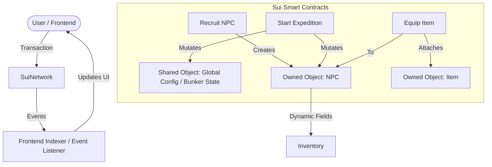

# 🛡️ ON-CHAIN BUNKER - Technical Documentation

> **Lưu ý**: Tài liệu này tập trung vào **Kiến trúc Kỹ thuật** và **Cấu trúc Source Code** của hệ thống Smart Contracts trên Sui Blockchain.

## 🏗️ Kiến trúc Tổng thể

Dự án **On-Chain Bunker** được thiết kế theo mô hình **Object-Centric** của Sui, tận dụng tối đa khả năng composability và true ownership.

### Luồng dữ liệu (Data Flow)



### Các thành phần chính

1.  **NPC (Non-Player Character)**:
    *   Là một **Owned Object** (thuộc sở hữu ví người dùng).
    *   Chứa toàn bộ chỉ số: HP, Stamina, Level, Profession, Rarity.
    *   **Level & Stats** là vĩnh viễn (permanent) và được lưu on-chain.
    *   **Inventory**: Sử dụng **Dynamic Object Fields** để gắn (attach) các Item objects vào NPC.

2.  **Item (Vật phẩm)**:
    *   Là một **Owned Object**.
    *   **Phân loại rõ ràng**:
        *   **Equippable** (Vũ khí, Giáp, Tool): Tăng chỉ số khi thám hiểm.
        *   **Consumable** (Thuốc, Thức ăn): Dùng để hồi phục hoặc cứu sống NPC.
        *   **Collectible** (Hàng sưu tầm - Type 99): Rarity cao, **KHÔNG THỂ EQUIP** (an toàn tuyệt đối khỏi rủi ro thám hiểm), dùng để sưu tầm/trading.

3.  **Bunker (Hầm trú ẩn)**:
    *   Quản lý tài nguyên tổng của người chơi (hoặc shared state tùy implementation).
    *   Nơi lưu trữ tài nguyên thu được từ thám hiểm.

4.  **Expedition (Thám hiểm)**:
    *   Logic cốt lõi xử lý "Game Loop".
    *   Tính toán xác suất (Probability) và Kết quả (Outcome) dựa trên RNG on-chain (Pseudo-random).
    *   Xử lý rủi ro: NPC bị thương hoặc **Bất tỉnh (Knocked Out)**.

---

## 📂 Cấu trúc Source Code

Source code nằm trong thư mục `Contracts/sources/`. Dưới đây là mô tả chi tiết từng module:

### 1. `utils.move` (Tiện ích & Hằng số)
Đây là module nền tảng, chứa:
*   **Constants**: Định nghĩa tất cả các chỉ số game, ngưỡng rarity, loại nghề nghiệp, loại item.
    *   *Ví dụ*: `RARITY_MYTHIC`, `PROFESSION_MEDIC`, `RECRUIT_COST_MIST`.
*   **Pseudo-Random Number Generator (PRNG)**: Hàm `generate_random_u64` và `random_in_range` dùng để roll các xác suất on-chain.
*   **Events**: Định nghĩa cấu trúc các Events quan trọng (`RecruitEvent`, `ExpeditionResultEvent`, `LevelUpEvent`, `DeathEvent`).
*   **Helper Functions**: Các hàm tính toán range chỉ số dựa trên rarity.

### 2. `item.move` (Hệ thống Vật phẩm)
Quản lý Object Item:
*   **Struct `Item`**: Định nghĩa object Item với các chỉ số bonus.
*   **`create_random_item`**: Logic tạo item ngẫu nhiên (rarity, type, stats) dựa trên PRNG.
*   **`destroy_item`**: Hàm burn item.
*   **Getters**: Các hàm lấy thông tin item.

### 3. `npc.move` (Hệ thống Nhân vật)
Trái tim của game, quản lý Object NPC:
*   **Struct `NPC`**: Định nghĩa object NPC.
*   **`recruit_npc`**: Logic mint NPC mới. Tốn phí SUI, random stats/nghề nghiệp.
*   **`equip_item` / `unequip_item`**: Logic sử dụng Dynamic Object Fields để gắn/gỡ Item vào NPC. Tự động cộng/trừ chỉ số bonus.
*   **`level_up`**: Hàm tăng stats cơ bản cho NPC.
*   **`take_damage`**: Hàm trừ HP.
*   **`knock_out`**: Hàm xử lý khi NPC hết máu (HP = 0).
*   **`revive_npc`**: Hồi sinh NPC bằng Revival Potion.

### 4. `expedition.move` (Logic Game Loop)
Xử lý logic thám hiểm:
*   **`start_expedition`**: Entry point chính.
    *   Kiểm tra điều kiện (Stamina, ready state).
    *   Trừ cost.
    *   Roll kết quả (Critical Success, Success, Failure, Critical Failure).
*   **Logic tính toán**:
    *   `calculate_success_rate`: Tính % thành công dựa trên Stats NPC + Item Bonus + Profession Bonus.
    *   `handle_...`: Các hàm xử lý từng kết quả cụ thể (trao thưởng, trừ máu, hoặc giết NPC).

### 5. `bunker.move` (Quản lý Hầm)
*   Quản lý tài nguyên và nâng cấp hầm trú ẩn. (Hiện tại là module bổ trợ).

---

## 🔧 Hướng dẫn nhanh cho Dev

### Quy trình phát triển (Workflow)
1.  **Chỉnh sửa Constants**: Muốn cân bằng game (balance), hãy sửa trong `utils.move`.
2.  **Thêm Logic Game**: Sửa `expedition.move` để thay đổi luật chơi.
3.  **Thêm Thuộc tính NPC**: Sửa struct `NPC` trong `npc.move` (lưu ý versioning nếu mainnet).

### Cách tích hợp Frontend
Xem chi tiết tại file: [FRONTEND_GUIDE.md](./FRONTEND_GUIDE.md) (Sắp cập nhật)

### Deploy
```bash
cd Contracts
sui move build
sui client publish --gas-budget 100000000
```